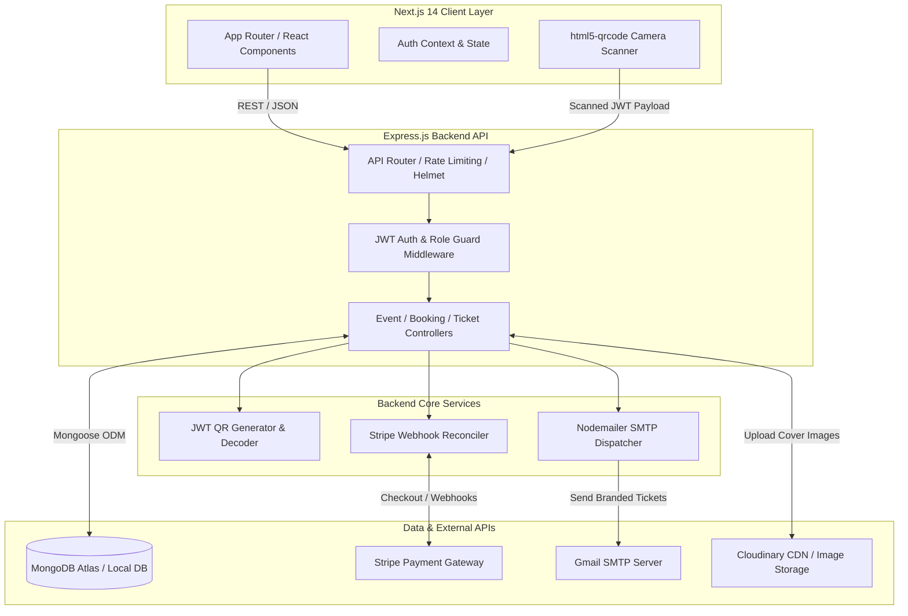
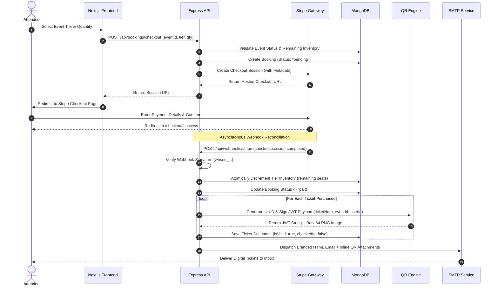
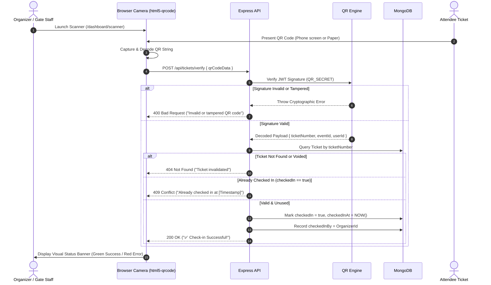

# 🎟️ EventHive — Enterprise Event Booking & Ticketing Platform

[](https://nextjs.org/)
[](https://www.typescriptlang.org/)
[](https://tailwindcss.com/)
[](https://nodejs.org/)
[](https://expressjs.com/)
[](https://www.mongodb.com/)
[](https://stripe.com/)
[](https://jwt.io/)

> **Book It. Live It.** — A state-of-the-art full-stack event discovery, booking, and check-in platform. Featuring real-time seat inventory management, Stripe checkout integration, tamper-proof JWT-signed QR ticket generation, instant email dispatch, and browser-based camera scanning for seamless event entrance verification.

---

## 📋 Table of Contents
1. [Platform Overview](#-platform-overview)
2. [Key Features & Capabilities](#-key-features--capabilities)
3. [System Architecture](#-system-architecture)
4. [Workflow Diagrams](#-workflow-diagrams)
   - [Event Booking & Payment Pipeline](#1-event-booking--payment-pipeline)
   - [QR Ticket Verification & Check-in Flow](#2-qr-ticket-verification--check-in-flow)
5. [Technology Stack](#-technology-stack)
6. [Database Schema & Data Models](#-database-schema--data-models)
7. [REST API Documentation](#-rest-api-documentation)
8. [Quick Start & Setup Guide](#-quick-start--setup-guide)
9. [Stripe Webhook Configuration](#-stripe-webhook-configuration)
10. [Test Accounts & Sandbox Cards](#-test-accounts--sandbox-cards)
11. [Project Directory Structure](#-project-directory-structure)

---

## 🌟 Platform Overview

**EventHive** bridges the gap between event organizers and attendees through an intuitive, modern, and highly responsive web application. Designed with vibrant glassmorphism aesthetics and dark-mode elegance, EventHive eliminates the friction of traditional event management by automating ticket issuance, payment reconciliation, and entrance security.

Whether hosting a 10,000-person music festival or a private tech workshop, EventHive provides organizers with real-time attendee tracking and an instant camera-based QR scanner requiring zero proprietary hardware.

---

## 🚀 Key Features & Capabilities

### 👥 For Attendees
- **Dynamic Event Discovery**: Browse events with multi-parameter filtering by category (Music, Tech, Sports, Food, Arts, etc.), date, city, and full-text keyword search.
- **Multi-Tier Ticket Selection**: Select between General Admission, VIP, Workshop passes, or Free Entry tiers with real-time remaining seat indicators.
- **Instant Secure Checkout**: Integrated directly with Stripe Checkout for PCI-compliant card processing and instant confirmation.
- **Digital QR Ticketing**: Receive tamper-proof, single-use QR code tickets directly in the web dashboard and via automated email attachments.
- **Offline-Ready Ticket Downloads**: Download high-resolution PNG QR tickets for seamless offline presentation at venue gates.

### 🎭 For Organizers & Admins
- **Comprehensive Event Management**: Create, edit, publish, and cancel events with custom ticket tiers, seat allocations, and detailed venue geolocations.
- **Live Inventory Tracking**: Atomic seat reduction prevents overselling during high-traffic checkout surges.
- **Hardware-Free QR Check-In Scanner**: Built-in browser scanner (`html5-qrcode`) utilizes laptop, tablet, or smartphone cameras to verify attendee tickets in milliseconds.
- **Fraud Prevention**: JWT-signed QR payloads ensure tickets cannot be duplicated, forged, or used after initial entrance check-in.
- **Attendee Roster & Analytics**: View full attendee lists, check-in timestamps, and ticket tier breakdowns per event.

---

## 🏗️ System Architecture

EventHive is built on a decoupled client-server architecture. The frontend communicates with the backend via a RESTful API secured by JSON Web Tokens (access + refresh token rotation).



---

## 🔄 Workflow Diagrams

### 1. Event Booking & Payment Pipeline
This diagram illustrates the end-to-end lifecycle from ticket selection to email delivery.



---

### 2. QR Ticket Verification & Check-in Flow
When an attendee arrives at the venue gate, organizers use the built-in camera scanner to validate entry.



---

## 🛠️ Technology Stack

| Layer | Framework / Library | Version | Purpose |
|---|---|---|---|
| **Frontend Core** | [Next.js](https://nextjs.org/) | `14.x` (App Router) | Server-Side Rendering, Static Optimization, Client Routing |
| **Language** | [TypeScript](https://www.typescriptlang.org/) | `5.x` | Strict type safety across frontend components and API clients |
| **Styling & UI** | [Tailwind CSS](https://tailwindcss.com/) | `3.4.x` | Utility-first responsive styling, custom design tokens, animations |
| **Icons & Alerts** | [Lucide React](https://lucide.dev/) / Hot Toast | `Latest` | Consistent iconography and real-time user feedback notifications |
| **Backend API** | [Express.js](https://expressjs.com/) | `4.18.x` | RESTful route handling, middleware pipelines, webhook endpoint |
| **Runtime** | [Node.js](https://nodejs.org/) | `18+` | Asynchronous event-driven server runtime |
| **Database** | [MongoDB](https://www.mongodb.com/) + [Mongoose](https://mongoosejs.com/) | `7.x` | Document-oriented NoSQL storage with strict schema validation |
| **Authentication** | `jsonwebtoken` + `bcryptjs` | `8.x` / `5.x` | Stateless JWT access/refresh tokens and password hashing |
| **Payments** | [Stripe Node SDK](https://stripe.com/) | `14.x` | Secure checkout session creation and webhook cryptographic verification |
| **QR Engine** | `qrcode` + `uuid` | `1.5.x` | Base64 PNG generation and cryptographic payload signing |
| **Scanner** | `html5-qrcode` | `2.3.x` | Real-time video stream barcode/QR parsing in mobile/desktop browsers |
| **Email Service** | [Nodemailer](https://nodemailer.com/) | `6.9.x` | SMTP transport for HTML ticket confirmation emails |

---

## 🗄️ Database Schema & Data Models

EventHive utilizes MongoDB with strict Mongoose schemas. Below is the relational mapping across collections:

```
+-----------------------------------+          +-----------------------------------+
|               USER                |          |               EVENT               |
+-----------------------------------+          +-----------------------------------+
| _id          : ObjectId (PK)      |<----+    | _id          : ObjectId (PK)      |
| name         : String             |     |    | title        : String             |
| email        : String (Unique)    |     |    | description  : String             |
| password     : String (Hashed)    |     +----| organizer    : ObjectId (User FK) |
| role         : Enum [att,org,adm] |          | category     : String             |
| refreshToken : String             |          | venue        : Object {name,city} |
| isActive     : Boolean            |          | ticketTiers  : Array [TierObject] |
+-----------------------------------+          | status       : Enum [draft,pub..] |
         ^                  ^                  +-----------------------------------+
         |                  |                                    ^
         |                  +------------------+                 |
         |                                     |                 |
+-----------------------------------+          +-----------------------------------+
|              BOOKING              |          |              TICKET               |
+-----------------------------------+          +-----------------------------------+
| _id          : ObjectId (PK)      |          | _id          : ObjectId (PK)      |
| user         : ObjectId (User FK) |          | booking      : ObjectId (Book FK) |
| event        : ObjectId (Event FK)|----------| event        : ObjectId (Event FK)|
| tierName     : String             |          | user         : ObjectId (User FK) |
| quantity     : Number             |          | ticketNumber : String (Unique EVH)|
| totalAmount  : Number             |          | qrCodeData   : String (JWT Hashed)|
| stripeSession: String (Unique)    |          | qrCodeImage  : String (Base64 PNG)|
| status       : Enum [pending,paid]|          | checkedIn    : Boolean (Default:F)|
| tickets      : Array [ObjectId]   |          | checkedInAt  : Date               |
+-----------------------------------+          +-----------------------------------+
```

---

## 🔌 REST API Documentation

All protected routes require an Authorization header: `Authorization: Bearer <access_token>`.

### Authentication (`/api/auth`)
| Method | Endpoint | Access | Description |
|---|---|---|---|
| `POST` | `/register` | Public | Register account as `attendee` or `organizer` |
| `POST` | `/login` | Public | Authenticate credentials and return JWT pair |
| `POST` | `/refresh` | Public | Generate new access token using valid refresh token |
| `POST` | `/logout` | Private | Invalidate stored refresh token |
| `GET` | `/me` | Private | Get authenticated user profile |

### Events (`/api/events`)
| Method | Endpoint | Access | Description |
|---|---|---|---|
| `GET` | `/` | Public | Browse published events (supports `?category=`, `?search=`, `?page=`) |
| `GET` | `/:id` | Public | Fetch single event details and remaining tier capacities |
| `POST` | `/` | Organizer/Admin | Create a new event with ticket tiers and venue details |
| `PUT` | `/:id` | Organizer/Admin | Update event parameters (must be event owner) |
| `PATCH` | `/:id/status` | Organizer/Admin | Toggle event status (`published`, `draft`, `cancelled`) |
| `DELETE` | `/:id` | Organizer/Admin | Soft-delete / cancel event |
| `GET` | `/my/events` | Organizer/Admin | Fetch all events created by logged-in organizer |

### Bookings & Stripe (`/api/bookings`)
| Method | Endpoint | Access | Description |
|---|---|---|---|
| `POST` | `/checkout` | Private | Initiate Stripe Checkout session for selected tier/qty |
| `GET` | `/my` | Private | Retrieve attendee booking history and payment status |
| `GET` | `/:id` | Private | Get booking receipt details |

### Tickets & Scanning (`/api/tickets`)
| Method | Endpoint | Access | Description |
|---|---|---|---|
| `GET` | `/my` | Private | Retrieve all active digital tickets with base64 QR codes |
| `POST` | `/verify` | Organizer/Admin | Verify scanned QR payload and execute gate check-in |
| `GET` | `/event/:eventId` | Organizer/Admin | Get attendee roster and check-in statuses for an event |

---

## ⚡ Quick Start & Setup Guide

### Prerequisites
1. **Node.js**: v18.0.0 or higher ([Download](https://nodejs.org/))
2. **MongoDB**: Local server or MongoDB Atlas Cluster ([Download](https://www.mongodb.com/try/download/community))
3. **Stripe Account**: Free developer test account ([Sign Up](https://stripe.com/))
4. **Stripe CLI**: For local webhook forwarding ([Download](https://github.com/stripe/stripe-cli/releases/latest))

### 1. Clone the Repository
```bash
git clone https://github.com/balaj-mir/EventHive.git
cd EventHive
```

### 2. Backend Setup & Configuration
```bash
cd backend
npm install
```

Create a `.env` file inside the `backend/` directory:
```env
PORT=5000
NODE_ENV=development
CLIENT_URL=http://localhost:3000

# MongoDB Connection
MONGO_URI=mongodb://localhost:27017/eventhive

# JWT Secrets (Generate random long strings)
JWT_SECRET=eventhive_jwt_super_secret_key_change_me
JWT_REFRESH_SECRET=eventhive_refresh_super_secret_key_change_me
JWT_EXPIRES_IN=15m
JWT_REFRESH_EXPIRES_IN=7d

# QR Cryptographic Signing Secret
QR_SECRET=eventhive_qr_signing_secret_key_change_me

# Stripe Test API Keys (From Stripe Developer Dashboard)
STRIPE_SECRET_KEY=sk_test_51...
STRIPE_WEBHOOK_SECRET=whsec_...

# Email Delivery (Gmail SMTP with App Password)
GMAIL_USER=your_email@gmail.com
GMAIL_APP_PASSWORD=xxxx xxxx xxxx xxxx
```

Seed the database with sample Pakistani events and test accounts:
```bash
node seed.js
```

Start the backend API development server:
```bash
npm run dev
# Server running on http://localhost:5000
```

### 3. Frontend Setup & Configuration
Open a new terminal window:
```bash
cd frontend
npm install
```

Create a `.env.local` file inside the `frontend/` directory:
```env
NEXT_PUBLIC_API_URL=http://localhost:5000
NEXT_PUBLIC_STRIPE_PUBLISHABLE_KEY=pk_test_51...
```

Start the Next.js frontend development server:
```bash
npm run dev
# Application accessible at http://localhost:3000
```

---

## 📡 Stripe Webhook Configuration

To receive automated payment confirmations locally and trigger QR ticket generation, forward Stripe events to your local API using the Stripe CLI:

1. Authenticate the Stripe CLI with your account:
   ```bash
   stripe login
   ```
2. Start listening and forwarding events to Express:
   ```bash
   stripe listen --forward-to http://localhost:5000/api/webhooks/stripe
   ```
3. Copy the webhook signing secret (`whsec_...`) printed in your terminal and paste it into `backend/.env` as `STRIPE_WEBHOOK_SECRET`.

---

## 🧪 Test Accounts & Sandbox Cards

When running `node seed.js`, the database is populated with three pre-configured accounts:

| Role | Email Address | Password | Capabilities |
|---|---|---|---|
| **Admin** | `admin@eventhive.com` | `Admin1234!` | Full platform access, manage any event/ticket |
| **Organizer** | `organizer@eventhive.com` | `Org12345!` | Host events, access QR scanner, view attendees |
| **Attendee** | `attendee@eventhive.com` | `Att12345!` | Browse events, purchase tickets, view QR codes |

### Stripe Test Credit Cards
Use any of the following test numbers during Stripe Checkout (use any future expiry date and any 3-digit CVC, e.g., `12/28` and `123`):

| Card Type | Card Number | Expected Checkout Result |
|---|---|---|
| **Visa (Success)** | `4242 4242 4242 4242` | Payment succeeds, tickets generated instantly |
| **Visa (Declined)** | `4000 0000 0000 0002` | Payment fails, booking remains pending/failed |
| **Mastercard** | `5555 5555 5555 4444` | Payment succeeds |

---

## 🗂️ Project Directory Structure

```
EventHive/
├── backend/                       # Express.js REST API Server
│   ├── src/
│   │   ├── config/                # Database and cloud integration configs
│   │   │   ├── cloudinary.js
│   │   │   └── db.js
│   │   ├── controllers/           # Route business logic handlers
│   │   │   ├── authController.js
│   │   │   ├── bookingController.js
│   │   │   ├── eventController.js
│   │   │   └── ticketController.js
│   │   ├── middleware/            # Security, auth, and validation middleware
│   │   │   ├── auth.js
│   │   │   └── errorHandler.js
│   │   ├── models/                # Mongoose ODM schemas
│   │   │   ├── Booking.js
│   │   │   ├── Event.js
│   │   │   ├── Ticket.js
│   │   │   └── User.js
│   │   ├── routes/                # Express API route endpoints
│   │   │   ├── auth.js
│   │   │   ├── bookings.js
│   │   │   ├── events.js
│   │   │   ├── tickets.js
│   │   │   └── webhook.js         # Raw body Stripe webhook handler
│   │   ├── services/              # External services and cryptographic engines
│   │   │   ├── emailService.js    # Nodemailer HTML template engine
│   │   │   └── qrService.js       # JWT QR signing & PNG base64 generator
│   │   ├── utils/                 # Helper utilities and token rotation
│   │   │   └── jwt.js
│   │   └── app.js                 # Express application setup & middleware stack
│   ├── .env                       # Backend environment variables
│   ├── package.json
│   └── seed.js                    # Automated database seeder script
│
├── frontend/                      # Next.js 14 App Router Web Application
│   ├── src/
│   │   ├── app/                   # Page routing and layout definitions
│   │   │   ├── checkout/
│   │   │   │   └── success/       # Stripe payment confirmation page
│   │   │   ├── dashboard/         # Role-protected user portals
│   │   │   │   ├── create-event/  # Multi-step event creation form
│   │   │   │   ├── my-events/     # Organizer management portal
│   │   │   │   ├── my-tickets/    # Attendee QR ticket wallet
│   │   │   │   └── scanner/       # Live camera check-in scanner
│   │   │   ├── events/
│   │   │   │   ├── [id]/          # Dynamic event detail & checkout widget
│   │   │   │   └── page.tsx       # Event discovery grid & filter catalog
│   │   │   ├── login/
│   │   │   ├── register/
│   │   │   ├── globals.css        # Tailwind design tokens & animations
│   │   │   ├── layout.tsx         # Global layout with AuthProvider & Toaster
│   │   │   └── page.tsx           # Landing page with hero & featured events
│   │   ├── components/            # Reusable modular UI components
│   │   │   ├── events/
│   │   │   │   └── EventCard.tsx  # Interactive event display card
│   │   │   ├── layout/
│   │   │   │   └── Navbar.tsx     # Responsive navigation & user dropdown
│   │   │   └── scanner/
│   │   │       └── QRScanner.tsx  # Browser camera video stream decoder
│   │   ├── context/               # Global React state management
│   │   │   └── AuthContext.tsx    # JWT token persistence & user state
│   │   └── lib/                   # API client libraries
│   │       └── api.ts             # Axios instance with auto-refresh interceptor
│   ├── .env.local                 # Frontend environment variables
│   ├── next.config.mjs
│   ├── package.json
│   ├── tailwind.config.ts
│   └── tsconfig.json
│
├── .gitignore                     # Root git ignore rules
└── README.md                      # Comprehensive project documentation
```

---

<p align="center">
  <b>EventHive</b> — Built for seamless ticketing, foolproof security, and unforgettable experiences. <br/>
  <i>Developed with ❤️ using Next.js, Node.js, and MongoDB.</i>
</p>
